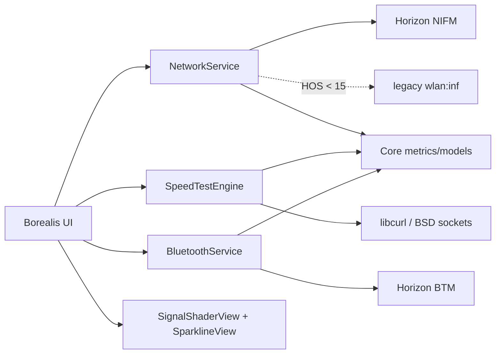

# switch-wifi

[](https://github.com/antoinebou12/switch-wifi/actions/workflows/ci.yml)
[](https://github.com/antoinebou12/switch-wifi/releases)
[](LICENSE)
[](CMakeLists.txt)
[](docs/COMPATIBILITY.md)
[](docs/COMPATIBILITY.md)
[](docs/COMPATIBILITY.md)

**`switch-wifi` is a Nintendo Switch Wi-Fi/network diagnostics and benchmark toolkit built with libnx, Borealis and libcurl.** It is designed to answer practical questions such as “is the Switch actually connected over Wi-Fi?”, “how stable is the network path?”, “what throughput am I getting?”, and “does this router/channel/configuration perform better?” without inventing radio metrics Horizon does not expose.

> Current compatibility target: **Atmosphère 1.11.2 / HOS 22.5.0**, with a released **libnx 4.10.0+** baseline and an additional CI lane that compiles against the current libnx `master`.

## Highlights

### Wi-Fi dashboard

- Link type: Wi-Fi, Ethernet or disconnected.
- Wi-Fi enabled state and current SSID.
- IPv4, subnet, gateway, DNS and MTU.
- Horizon Wi-Fi strength, 0-3 bars.
- Legacy RSSI in dBm on firmware where `wlan:inf` is available.
- Signal-quality classification and rolling history.
- **Shader-style signal panel** rendered through Borealis/NanoVG's GPU rendering path.

### Wi-Fi benchmark

- Cancellable HTTPS benchmark using libcurl.
- **8 latency probes by default** instead of a single request.
- Minimum, average, median and P95 application latency.
- Successive-difference jitter estimate.
- Download throughput, default 25 MiB.
- Upload throughput, default 10 MiB.
- Download and latency history graphs.
- Zero-filled generated upload buffer: no user file is uploaded.
- Cloudflare-compatible defaults, with endpoints configurable in code.

The benchmark measures the complete HTTPS path, not the raw Wi-Fi PHY link. For controlled Wi-Fi testing, use a compatible server on the local wired LAN. See [Benchmarking](docs/BENCHMARKING.md).

### Wi-Fi environment

- Basic saved-network metadata without requesting full saved credential profiles.
- Authentication/encryption labels.
- Horizon allowed-channel query on HOS 6.0.0+.
- 2.4 GHz and 5 GHz channel/frequency helpers.
- Tested channel-overlap and contention-proxy math.
- Nearby AP scan kept behind a hardware-verification boundary until opaque Horizon AP records can be decoded safely across firmware versions.
- RF noise floor and SNR shown as **unavailable** rather than inferred from unrelated values.

### Bluetooth diagnostics

- BTM service/radio state.
- Connected and known device counts on supported firmware.
- Explicit bounded passive BLE discovery.
- Unique device addresses only where libnx exposes the rest of the advertisement record as opaque.
- No pairing, disconnect or controller modification.

### Diagnostics export

The About tab writes a plain-text report containing the app version, compatibility target, current network information, basic saved-profile metadata and Bluetooth counts. Credentials are never displayed or exported.

## UI

The Borealis interface is organized around five controller/touch-friendly tabs:

| Tab | Purpose |
| --- | --- |
| **Dashboard** | Connection status, shader signal visualization and rolling signal history |
| **Networks** | Saved profile metadata, allowed channels and radio-metric provenance |
| **Benchmark** | Latency distribution, jitter, download/upload speed and history graphs |
| **Bluetooth** | BTM state, connected/known devices and passive BLE scan |
| **About** | Version, compatibility notes and diagnostics export |

The custom graph/status views use NanoVG gradient paints and glow layers inside Borealis' existing rendering pipeline. This gives the UI a shader-like GPU effect without taking ownership of raw OpenGL state from Borealis.

## Metric provenance

`switch-wifi` deliberately labels metrics by what they actually represent:

| Metric | Source | Meaning |
| --- | --- | --- |
| RSSI dBm | legacy `wlan:inf` | Direct radio signal value where supported |
| Wi-Fi bars | NIFM | Horizon-reported 0-3 signal strength |
| HTTPS latency | libcurl | Application/network-path latency, not ICMP ping |
| Download/upload Mbps | libcurl | End-to-end payload throughput |
| Contention score | derived | Relative channel-overlap proxy, not RF noise |
| RF noise / SNR | unavailable | Not fabricated when no verified API is available |

## Architecture



Full diagrams: [UML and runtime flows](docs/UML.md), [Architecture](docs/ARCHITECTURE.md).

## Build an NRO

### Recommended: official devkitPro container

Clone recursively so Borealis is present:

```bash
git clone --recursive https://github.com/antoinebou12/switch-wifi.git
cd switch-wifi
```

Then build with the official Switch toolchain container:

```bash
docker run --rm \
  -v "$PWD:/work" -w /work \
  devkitpro/devkita64:latest \
  bash -lc 'cmake -S . -B build-switch \
    -DPLATFORM_SWITCH=ON \
    -DUSE_GLFW=ON \
    -DCMAKE_BUILD_TYPE=Release && \
    cmake --build build-switch --target switch-wifi.nro --parallel'
```

Output:

```text
build-switch/switch-wifi.nro
```

Verify the NRO container header:

```bash
python3 scripts/verify_nro.py build-switch/switch-wifi.nro
```

### Native devkitPro installation

The same CMake commands work from a configured devkitA64/devkitPro environment:

```bash
cmake -S . -B build-switch -DPLATFORM_SWITCH=ON -DUSE_GLFW=ON -DCMAKE_BUILD_TYPE=Release
cmake --build build-switch --target switch-wifi.nro --parallel
```

## Unit tests

The platform-independent metric, history, channel and benchmark-statistics code is tested on the host.

```bash
cmake -S . -B build-host \
  -DSWITCH_WIFI_BUILD_APP=OFF \
  -DSWITCH_WIFI_BUILD_TESTS=ON \
  -DSWITCH_WIFI_WARNINGS_AS_ERRORS=ON \
  -DCMAKE_BUILD_TYPE=Release
cmake --build build-host --parallel
ctest --test-dir build-host --output-on-failure
```

The suite is split into:

- `switch_wifi_metrics_tests`;
- `switch_wifi_history_tests`;
- `switch_wifi_benchmark_tests`.

Sanitizer build:

```bash
cmake -S . -B build-sanitize \
  -DSWITCH_WIFI_BUILD_APP=OFF \
  -DSWITCH_WIFI_BUILD_TESTS=ON \
  -DSWITCH_WIFI_ENABLE_SANITIZERS=ON \
  -DCMAKE_BUILD_TYPE=Debug
cmake --build build-sanitize --parallel
ctest --test-dir build-sanitize --output-on-failure
```

## CI/CD

### CI on every push/PR

- GCC host unit tests with warnings as errors.
- Clang host unit tests with warnings as errors.
- ASan + UBSan test lane.
- NRO build using `devkitpro/devkita64:20260219` as a reproducible baseline.
- NRO build using `devkitpro/devkita64:latest`.
- **NRO build after compiling current `switchbrew/libnx` master**.
- NRO header verification and SHA-256 generation.
- Uploaded `.nro` artifacts for device testing.

### CD on `vX.Y.Z` tags

The release workflow checks that the tag matches `project(... VERSION ...)`, reruns tests, builds/verifies the NRO, generates SHA-256 checksums, packages a ZIP, then publishes those files to a GitHub Release.

See [Development](docs/DEVELOPMENT.md) and [Compatibility](docs/COMPATIBILITY.md).

## Compatibility and Horizon notes

The released baseline is libnx 4.10.0+, while CI also compiles against the newest libnx `master`. A local compatibility adapter is used for the basic NIFM profile-enumeration command so the source does not require a wrapper that appeared only after the 4.10.0 release.

HOS 15+ removed the legacy `wlan:inf` path used for direct RSSI. On modern firmware the dashboard therefore uses NIFM signal bars until a verified modern WLAN implementation is hardware-tested. The app never converts 0-3 bars into fake dBm.

See the complete [compatibility matrix](docs/COMPATIBILITY.md).

## Documentation

- [Architecture](docs/ARCHITECTURE.md)
- [Benchmark methodology](docs/BENCHMARKING.md)
- [Compatibility matrix](docs/COMPATIBILITY.md)
- [Development guide](docs/DEVELOPMENT.md)
- [UML / Mermaid / PlantUML](docs/UML.md)
- [Research notes](docs/RESEARCH.md)
- [Implementation plan](docs/PLAN.md)

## Privacy and safety

- Saved-profile enumeration uses basic metadata records instead of requesting full saved profile objects.
- The current active network profile is used for connection display; credential fields are never displayed, exported or retained intentionally.
- No Wi-Fi deauthentication, packet injection, credential capture or monitor-mode attack features.
- No Bluetooth pairing/disconnect/controller modification.
- Upload benchmarking sends generated zero-filled memory, not user files.
- A contention proxy is never labeled as RF noise or SNR.

## License

MIT, see [LICENSE](LICENSE).
