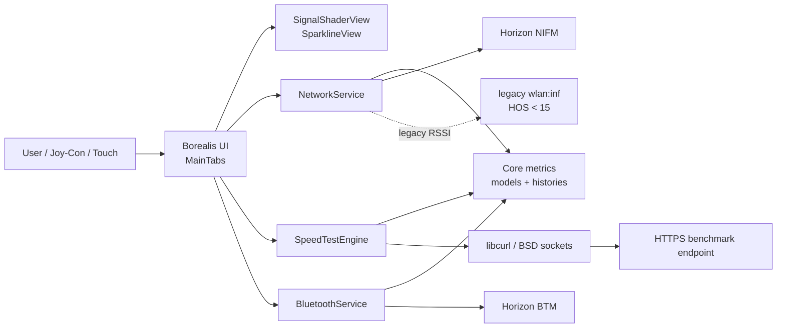
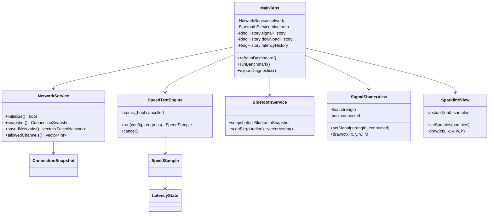
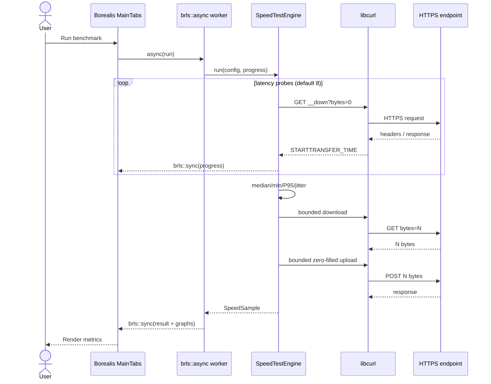
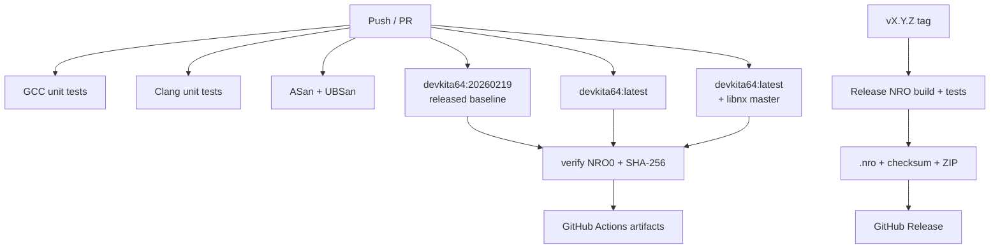

# UML and runtime flows

The diagrams below are source-controlled Mermaid so GitHub can render them directly. A PlantUML equivalent is also kept in [`uml/switch-wifi.puml`](uml/switch-wifi.puml).

## Component diagram

## Class diagram

## Benchmark sequence

## CI/CD deployment diagram

